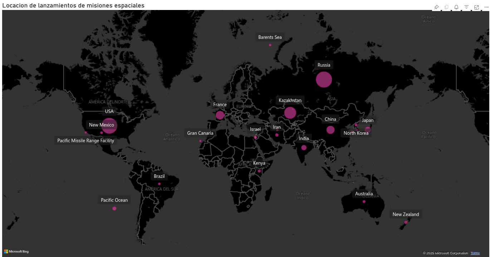
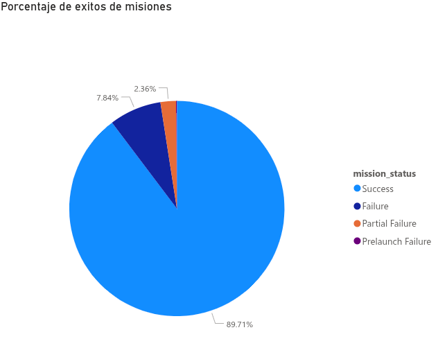
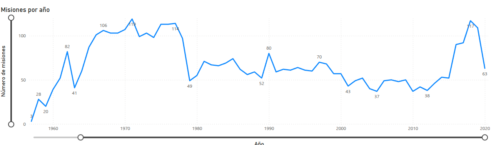
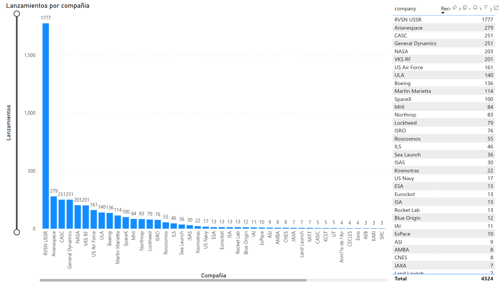
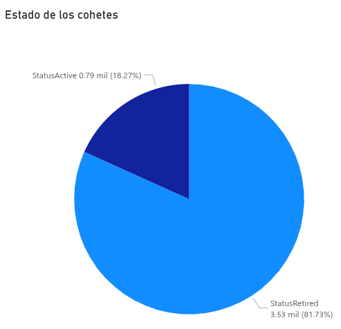
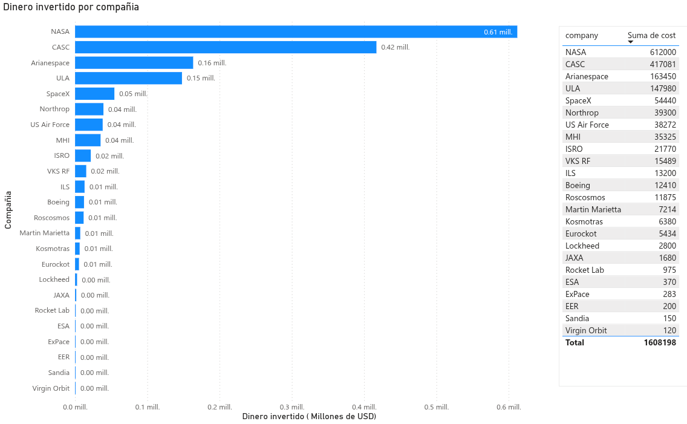

# SpaceLaunches

This project aims to explore and analyze the complete history of space missions recorded from 1957 to 2020, using a dataset that includes information on the launching company, launch site, rocket status, mission outcome, and, in some cases, the estimated cost. The dataset includes 4,319 unique records.

Objectives

- Conduct an exploratory analysis
- Identify the countries and companies with the highest number of space missions
- Analyze the historical evolution of space launches
- Analyze the percentage of successful space missions
- Investigate the economic investment in space launches

Tools Used

- Python
- Spyder (IDE)
- Excel
- Power BI (Data Visualization)

Results

Lauch location
The image shows the locations where there have been space missions from 1957 to 2020, where Russia (1395) has been the country with the highest number of launches, followed by the United States (1344) and Kazakhstan (701).

Mission Success Rate

- Failure: 7.84%
- Partial Failure: 2.36%
- Prelaunch Failure: 0.09%
- Success: 89.71%

Launches per year

Launches per company

Rocket Status

Total amount of money invested

